# SIEM Threat Detection & Automated Response Lab


### *Threat Detection & Automated Defense*

[Tools](#tools) • [Quick Start](#quick-start) • [Homelab Architecture](#homelab-architecture) • [Attack Simulation](#attack-simulation) • [Wazuh SIEM Dashboard](#wazuh-siem-dashboard)

---

## Project Overview

<div align="center">
  
A complete Security Information and Event Management (SIEM) lab that combines threat detection with automated active defense capabilities. This project demonstrates how to build security monitoring environment using open-source tools and Ubuntu VM.

</div>

---

## Tools
| Tool | Description |
|:-------:|:-----------:|
| Wazuh | SIEM/XDR platform for security monitoring, threat detection, vulnerability detection, and automated response |
| Docker | Containerization and deployment |
| Keycloak | IAM for Single-Sign-On and authentication |
| UFW | Uncomplicated Firewall for Linux packet-filtering |
| Nginx | Web Server, High performance, reverse proxy, attack surface |

---

## Homelab Architecture

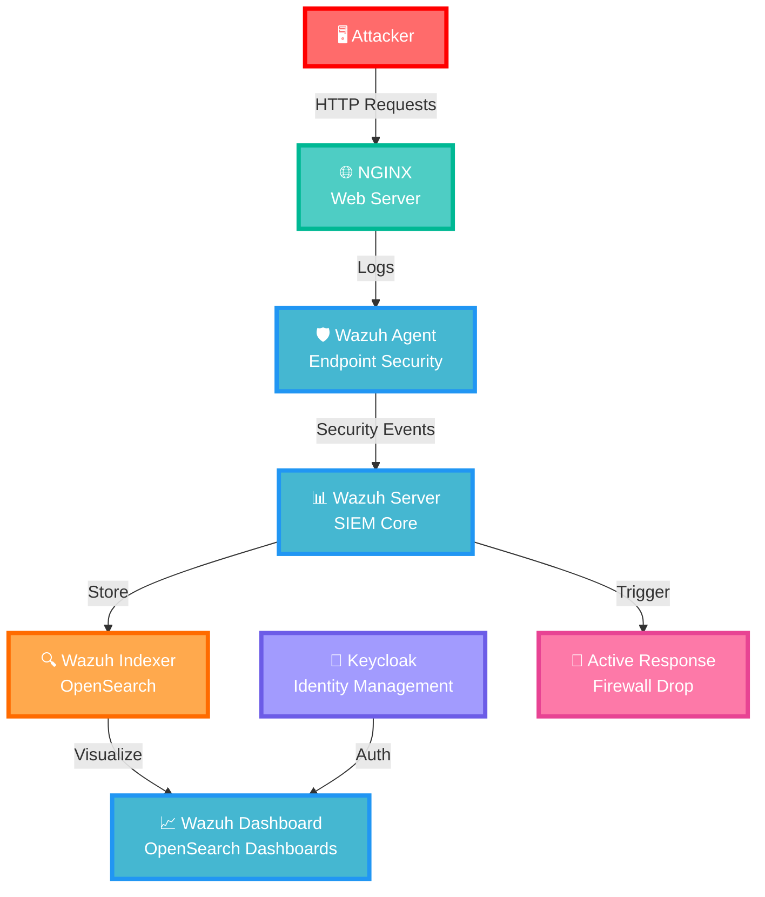
---

## Quick Start

### Prerequisites
- Ubuntu Linux VM
- Docker Engine
- Docker Compose v2
- 8 GB RAM minimum for this lab configuration
- 20 GB available disk space

### Installation
```bash
# Clone the repository
git clone https://github.com/AljawharaK/SIEM-Threat-Detection-and-Automated-Response-Lab.git
cd SIEM_Active_Defense_Lab

# Review the Wazuh certificate configuration
# Update config/certs.yml if your environment requires custom hostnames/IPs

# Generate SSL certificates for secure communication
docker compose -f generate-indexer-certs.yml run --rm generator

# Start the complete stack
docker compose up -d

# Verify all services are running
docker compose ps
```

### Access Services
| Service | URL | Credentials |
|:-------:|:-----------:|:-----------:|
| Wazuh Dashboard | https://localhost:443 | Configure in `docker-compose.yml` |
| Keycloak | http://localhost:8081 | Configure in `docker-compose.yml` |

---

## Attack Simulation

### Real-World Attack Scenarios with Automated Response

The attack simulation phase demonstrates the complete security detection and response lifecycle using Kali Linux as the attacker machine targeting the Ubuntu host running Nginx web server. Wazuh SIEM captures and analyzes all attack patterns while the Active Response module enforces firewall rules.

| Attack Type | Method |
|:-------:|:-----------:|
| Shellshock | () { :;}; /bin/bash -c 'echo vulnerable' |
| Nmap Scan | nmap -sV -p 80,443,1514,1515,55000 target |
| Curl Exploit | curl -X GET http://target:80 |

<p align="center">
  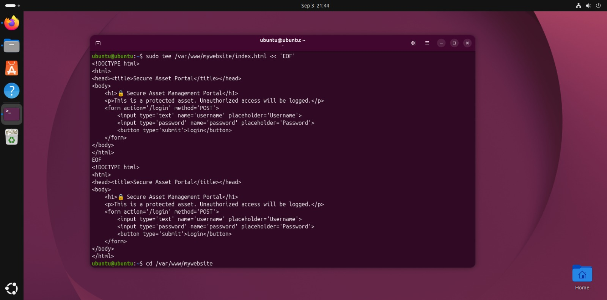
  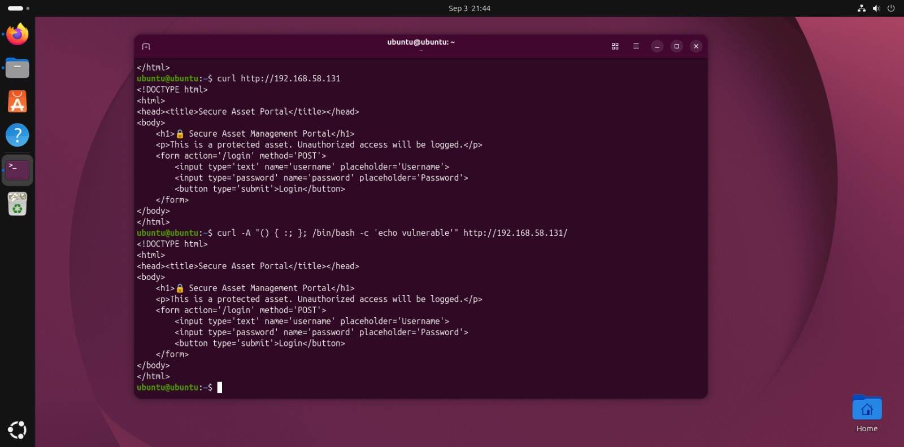
  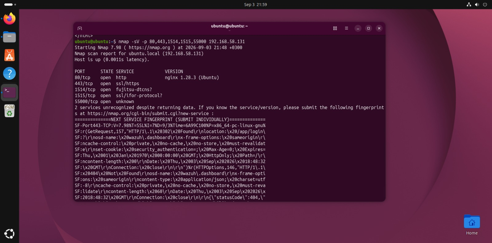
  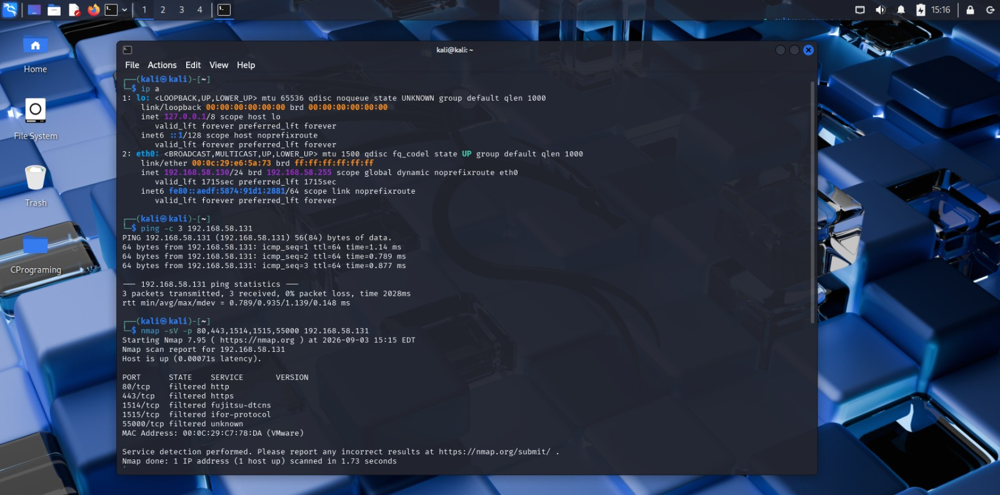
  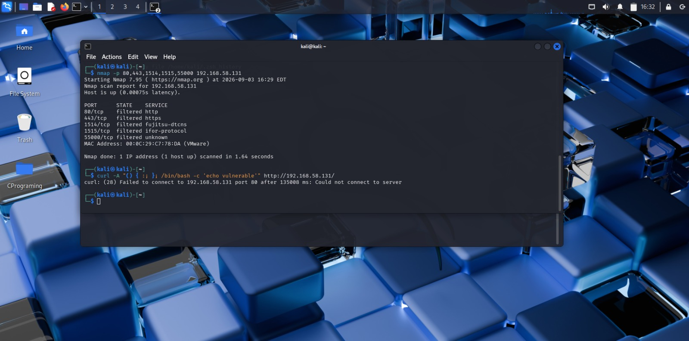
</p> 

### Wazuh SIEM Dashboard

Wazuh monitored the website and logged alerts:

<p align="center">
  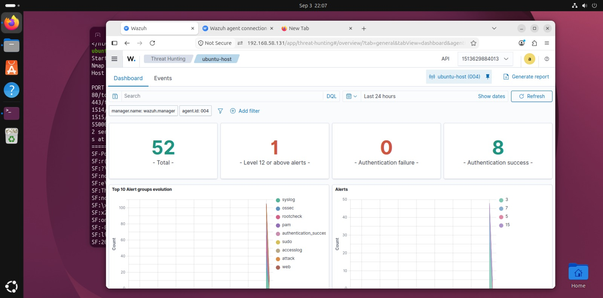
  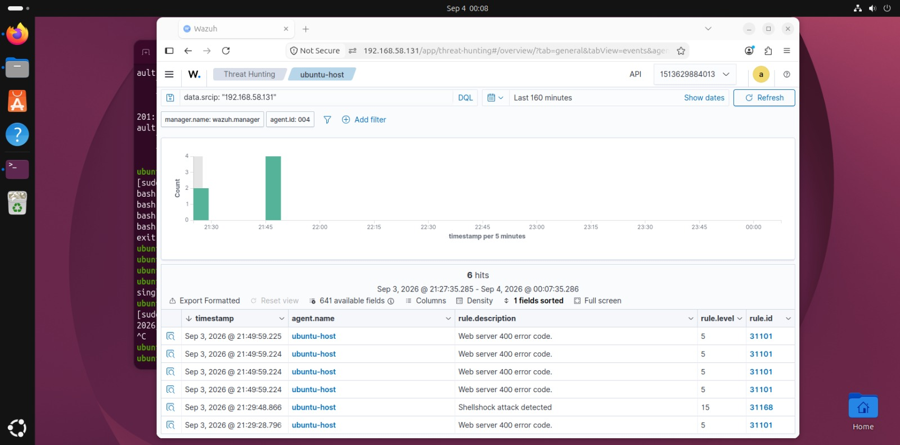
  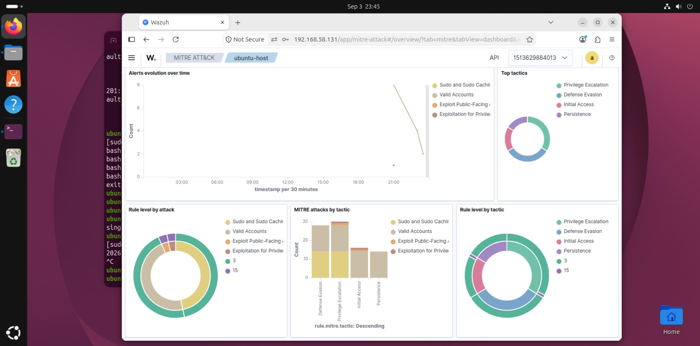
  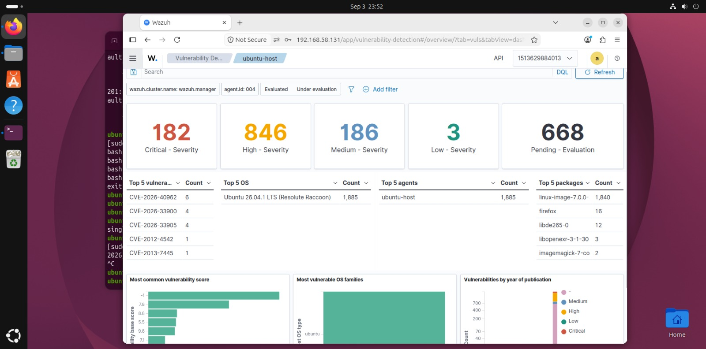
</p> 

Active Response enforces firewall rules automatically:

<p align="center">
  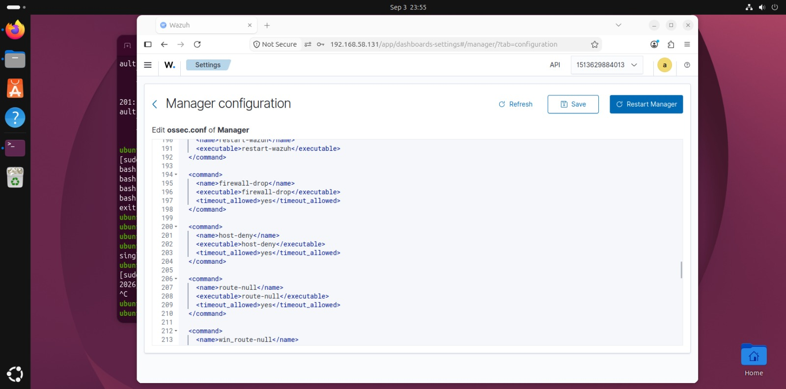
</p> 

---

## Security Hardening

### Keycloak IAM

Keycloak is an open-source identity and access management (IAM) platform that enables developers and system administrators to oversee authentication, authorization, and user identity processes across different applications. By centralizing user login functionality and supporting integration with various identity providers, it streamlines and fortifies access to apps and services. In corporate settings, Keycloak is commonly adopted to enforce single sign-on (SSO), multi-factor authentication (MFA), and other security standards across a diverse range of systems.

Core Features of Keycloak

- Single Sign-On (SSO): With a single login, users can gain entry to numerous applications without repeated authentication, improving both ease of use and system security.

- Multi-Factor Authentication (MFA): Keycloak offers support for a variety of MFA options, including one-time passwords (OTP) delivered via mobile apps, email, SMS, or custom-built solutions, adding an extra layer of protection for user accounts.

<p align="center">
  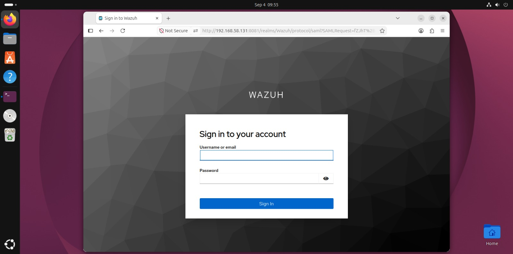
  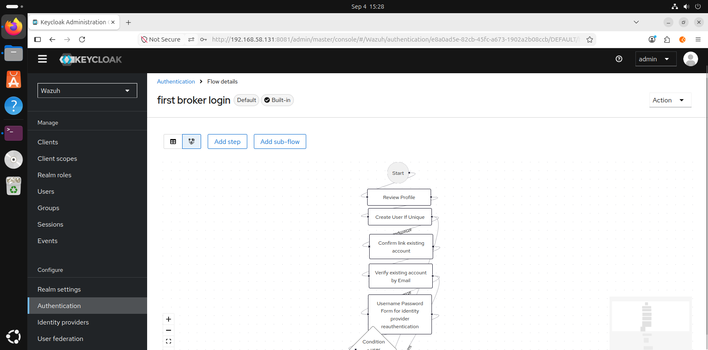
  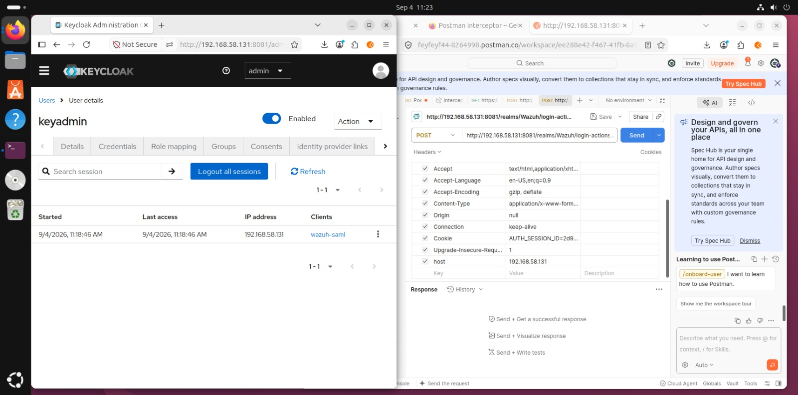
</p> 

### UFW Uncomplicated Firewall

UFW (Uncomplicated Firewall) is a user-friendly front-end for managing iptables firewall rules, designed to simplify the process of configuring network security on Linux systems and Docker container traffic.

Core Features of UFW

- Simplified Rule Management: UFW uses straightforward commands—such as allow, deny, and delete—to manage firewall rules, making it accessible even for users with limited networking experience.

- Application Profiles: UFW supports pre-configured application profiles (e.g., for OpenSSH, Apache, or Nginx), enabling quick and consistent rule setup for common services without manually specifying ports or protocols.

- Logging and Monitoring: UFW provides built-in logging capabilities that allow administrators to track connection attempts, detect suspicious activity, and monitor firewall behavior for security auditing and troubleshooting purposes.

```bash
# Add these filters
sudo ufw-docker install
sudo systemctl restart ufw
sudo ufw-docker allow single-node-wazuh.manager-1 1514/tcp
sudo ufw-docker allow single-node-wazuh.manager-1 1515/tcp
sudo ufw-docker allow single-node-wazuh.manager-1 55000/tcp
sudo ufw-docker allow single-node-wazuh.dashboard-1 5601/tcp
sudo ufw-docker allow single-node-wazuh.dashboard-1 80/tcp
sudo ufw-docker allow single-node-wazuh.dashboard-1 443/tcp
```
---

## Results

The lab demonstrated a complete security operations workflow:
- Detection: Wazuh agent monitors system and application logs

- Analysis: Wazuh manager correlates events with rule sets

- Visualization: Wazuh dashboard displays real-time alerts

- Response: Active Response enforces firewall rules automatically

- Authentication: Keycloak provides secure access control

---
